<!-- Generated by tools/poster.py from tools/profile.json and tools/tech.json. Edit those, then rebuild. -->

  <a href="https://tahir-zineb.github.io/"><picture><source media="(prefers-color-scheme: dark)" srcset="assets/profile-dark.svg"><source media="(prefers-color-scheme: light)" srcset="assets/profile-light.svg"></picture></a>

  <a href="https://tahir-zineb.github.io/"><b>Portfolio</b></a> ·
  <a href="https://www.linkedin.com/in/z-tahir">LinkedIn</a> ·
  <a href="mailto:zineb.tahirr@hotmail.com">Email</a> ·
  <a href="https://tahir-zineb.github.io/assets/cv/Zineb_TAHIR_CV.pdf">Resume (PDF)</a>

## About me

I'm a **junior DevOps & systems engineer** in France. On a work-study contract at **LNA Santé** (Nantes) I automate audit and compliance reporting over a fleet of ~5 000 workstations, run multi-site supervision, and handle N2/N3 system administration. I'm comfortable with scripting (Python, PowerShell, Bash), CI/CD (Git, Jenkins), containers (Docker, Kubernetes) and AWS. Currently completing a Master's in Networks & Telecommunications at Université de Reims Champagne-Ardenne.

My full résumé, projects and certifications are on my **[portfolio](https://tahir-zineb.github.io/)**.

Poster generated by <a href="tools/">tools/</a> · logos from Simple Icons (CC0) and the AWS Architecture Icons · all trademarks belong to their owners.

