<!-- Generated by tools/build_assets.py from tools/profile.json and tools/tech.json. Edit those, then rebuild. -->

  <a href="https://m-elkhou.github.io/"><picture><source media="(prefers-color-scheme: dark)" srcset="assets/ui/dark/header.svg"><source media="(prefers-color-scheme: light)" srcset="assets/ui/light/header.svg"></picture></a>

  <a href="https://m-elkhou.github.io/"><picture><source media="(prefers-color-scheme: dark)" srcset="assets/ui/dark/button-portfolio.svg"><source media="(prefers-color-scheme: light)" srcset="assets/ui/light/button-portfolio.svg"></picture></a>
  <a href="https://www.linkedin.com/in/m-elkhou/"><picture><source media="(prefers-color-scheme: dark)" srcset="assets/ui/dark/button-linkedin.svg"><source media="(prefers-color-scheme: light)" srcset="assets/ui/light/button-linkedin.svg"></picture></a>
  <a href="mailto:m.elkhou@hotmail.com"><picture><source media="(prefers-color-scheme: dark)" srcset="assets/ui/dark/button-email.svg"><source media="(prefers-color-scheme: light)" srcset="assets/ui/light/button-email.svg"></picture></a>
  <a href="https://m-elkhou.github.io/assets/cv/Mohammed_EL-KHOU_CV.pdf"><picture><source media="(prefers-color-scheme: dark)" srcset="assets/ui/dark/button-cv.svg"><source media="(prefers-color-scheme: light)" srcset="assets/ui/light/button-cv.svg"></picture></a>

  <picture><source media="(prefers-color-scheme: dark)" srcset="assets/ui/dark/metrics.svg"><source media="(prefers-color-scheme: light)" srcset="assets/ui/light/metrics.svg"></picture>

  <picture><source media="(prefers-color-scheme: dark)" srcset="assets/ui/dark/section-about.svg"><source media="(prefers-color-scheme: light)" srcset="assets/ui/light/section-about.svg"></picture>

I'm a **Data & Cloud Engineer** in Paris with 6+ years of experience. At **RMC BFM ADS (Altice Media)** I build the data platforms behind TV and digital advertising: Python ETL and data warehouses, serverless pipelines on AWS, and LLM-powered audience matching on Amazon Bedrock.

Before that I ran Big Data pipelines on Cloudera for **BPCE-SI**, and took computer-vision, NLP and speech models to production at **IMPERIUM** and **3W Media**. MSc in Data Science & AI, Université Sorbonne Paris Nord.

My full résumé, projects and certifications are on my **[portfolio](https://m-elkhou.github.io/)** · [projects](https://m-elkhou.github.io/#projects) · [résumé (PDF)](https://m-elkhou.github.io/assets/cv/Mohammed_EL-KHOU_CV.pdf).

  <picture><source media="(prefers-color-scheme: dark)" srcset="assets/ui/dark/section-doing.svg"><source media="(prefers-color-scheme: light)" srcset="assets/ui/light/section-doing.svg"></picture>

  <picture><source media="(prefers-color-scheme: dark)" srcset="assets/ui/dark/doing-1.svg"><source media="(prefers-color-scheme: light)" srcset="assets/ui/light/doing-1.svg"></picture>
  <picture><source media="(prefers-color-scheme: dark)" srcset="assets/ui/dark/doing-2.svg"><source media="(prefers-color-scheme: light)" srcset="assets/ui/light/doing-2.svg"></picture>
  <picture><source media="(prefers-color-scheme: dark)" srcset="assets/ui/dark/doing-3.svg"><source media="(prefers-color-scheme: light)" srcset="assets/ui/light/doing-3.svg"></picture>
  <picture><source media="(prefers-color-scheme: dark)" srcset="assets/ui/dark/doing-4.svg"><source media="(prefers-color-scheme: light)" srcset="assets/ui/light/doing-4.svg"></picture>

  <picture><source media="(prefers-color-scheme: dark)" srcset="assets/ui/dark/section-stack.svg"><source media="(prefers-color-scheme: light)" srcset="assets/ui/light/section-stack.svg"></picture>

  <picture><source media="(prefers-color-scheme: dark)" srcset="assets/ui/dark/cat-languages.svg"><source media="(prefers-color-scheme: light)" srcset="assets/ui/light/cat-languages.svg"></picture>

  <picture><source media="(prefers-color-scheme: dark)" srcset="assets/icons/dark/python.svg"><source media="(prefers-color-scheme: light)" srcset="assets/icons/light/python.svg">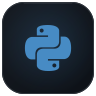</picture>
  <picture><source media="(prefers-color-scheme: dark)" srcset="assets/icons/dark/scala.svg"><source media="(prefers-color-scheme: light)" srcset="assets/icons/light/scala.svg"></picture>
  <picture><source media="(prefers-color-scheme: dark)" srcset="assets/icons/dark/sql.svg"><source media="(prefers-color-scheme: light)" srcset="assets/icons/light/sql.svg">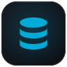</picture>
  <picture><source media="(prefers-color-scheme: dark)" srcset="assets/icons/dark/java.svg"><source media="(prefers-color-scheme: light)" srcset="assets/icons/light/java.svg"></picture>
  <picture><source media="(prefers-color-scheme: dark)" srcset="assets/icons/dark/bash.svg"><source media="(prefers-color-scheme: light)" srcset="assets/icons/light/bash.svg">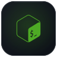</picture>
  <picture><source media="(prefers-color-scheme: dark)" srcset="assets/icons/dark/typescript.svg"><source media="(prefers-color-scheme: light)" srcset="assets/icons/light/typescript.svg">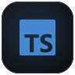</picture>
  <picture><source media="(prefers-color-scheme: dark)" srcset="assets/icons/dark/javascript.svg"><source media="(prefers-color-scheme: light)" srcset="assets/icons/light/javascript.svg"></picture>

  <picture><source media="(prefers-color-scheme: dark)" srcset="assets/ui/dark/cat-data.svg"><source media="(prefers-color-scheme: light)" srcset="assets/ui/light/cat-data.svg"></picture>

  <picture><source media="(prefers-color-scheme: dark)" srcset="assets/icons/dark/spark.svg"><source media="(prefers-color-scheme: light)" srcset="assets/icons/light/spark.svg"></picture>
  <picture><source media="(prefers-color-scheme: dark)" srcset="assets/icons/dark/hadoop.svg"><source media="(prefers-color-scheme: light)" srcset="assets/icons/light/hadoop.svg">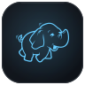</picture>
  <picture><source media="(prefers-color-scheme: dark)" srcset="assets/icons/dark/hive.svg"><source media="(prefers-color-scheme: light)" srcset="assets/icons/light/hive.svg"></picture>
  <picture><source media="(prefers-color-scheme: dark)" srcset="assets/icons/dark/kafka.svg"><source media="(prefers-color-scheme: light)" srcset="assets/icons/light/kafka.svg">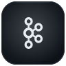</picture>
  <picture><source media="(prefers-color-scheme: dark)" srcset="assets/icons/dark/cloudera.svg"><source media="(prefers-color-scheme: light)" srcset="assets/icons/light/cloudera.svg"></picture>
  <picture><source media="(prefers-color-scheme: dark)" srcset="assets/icons/dark/airflow.svg"><source media="(prefers-color-scheme: light)" srcset="assets/icons/light/airflow.svg">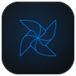</picture>
  <picture><source media="(prefers-color-scheme: dark)" srcset="assets/icons/dark/talend.svg"><source media="(prefers-color-scheme: light)" srcset="assets/icons/light/talend.svg">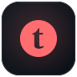</picture>
  <picture><source media="(prefers-color-scheme: dark)" srcset="assets/icons/dark/pandas.svg"><source media="(prefers-color-scheme: light)" srcset="assets/icons/light/pandas.svg">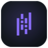</picture>
  <picture><source media="(prefers-color-scheme: dark)" srcset="assets/icons/dark/numpy.svg"><source media="(prefers-color-scheme: light)" srcset="assets/icons/light/numpy.svg">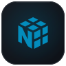</picture>
  <picture><source media="(prefers-color-scheme: dark)" srcset="assets/icons/dark/arrow.svg"><source media="(prefers-color-scheme: light)" srcset="assets/icons/light/arrow.svg"></picture>
  <picture><source media="(prefers-color-scheme: dark)" srcset="assets/icons/dark/parquet.svg"><source media="(prefers-color-scheme: light)" srcset="assets/icons/light/parquet.svg">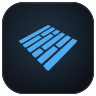</picture>
  <picture><source media="(prefers-color-scheme: dark)" srcset="assets/icons/dark/jupyter.svg"><source media="(prefers-color-scheme: light)" srcset="assets/icons/light/jupyter.svg"></picture>

  <picture><source media="(prefers-color-scheme: dark)" srcset="assets/ui/dark/cat-aws.svg"><source media="(prefers-color-scheme: light)" srcset="assets/ui/light/cat-aws.svg"></picture>

  <picture><source media="(prefers-color-scheme: dark)" srcset="assets/icons/dark/aws.svg"><source media="(prefers-color-scheme: light)" srcset="assets/icons/light/aws.svg"></picture>
  <picture><source media="(prefers-color-scheme: dark)" srcset="assets/icons/dark/s3.svg"><source media="(prefers-color-scheme: light)" srcset="assets/icons/light/s3.svg"></picture>
  <picture><source media="(prefers-color-scheme: dark)" srcset="assets/icons/dark/athena.svg"><source media="(prefers-color-scheme: light)" srcset="assets/icons/light/athena.svg">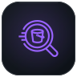</picture>
  <picture><source media="(prefers-color-scheme: dark)" srcset="assets/icons/dark/glue.svg"><source media="(prefers-color-scheme: light)" srcset="assets/icons/light/glue.svg">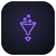</picture>
  <picture><source media="(prefers-color-scheme: dark)" srcset="assets/icons/dark/lakeformation.svg"><source media="(prefers-color-scheme: light)" srcset="assets/icons/light/lakeformation.svg">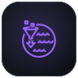</picture>
  <picture><source media="(prefers-color-scheme: dark)" srcset="assets/icons/dark/lambda.svg"><source media="(prefers-color-scheme: light)" srcset="assets/icons/light/lambda.svg">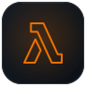</picture>
  <picture><source media="(prefers-color-scheme: dark)" srcset="assets/icons/dark/ec2.svg"><source media="(prefers-color-scheme: light)" srcset="assets/icons/light/ec2.svg">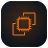</picture>
  <picture><source media="(prefers-color-scheme: dark)" srcset="assets/icons/dark/ecs.svg"><source media="(prefers-color-scheme: light)" srcset="assets/icons/light/ecs.svg">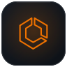</picture>
  <picture><source media="(prefers-color-scheme: dark)" srcset="assets/icons/dark/fargate.svg"><source media="(prefers-color-scheme: light)" srcset="assets/icons/light/fargate.svg"></picture>
  <picture><source media="(prefers-color-scheme: dark)" srcset="assets/icons/dark/ecr.svg"><source media="(prefers-color-scheme: light)" srcset="assets/icons/light/ecr.svg">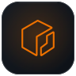</picture>
  <picture><source media="(prefers-color-scheme: dark)" srcset="assets/icons/dark/stepfunctions.svg"><source media="(prefers-color-scheme: light)" srcset="assets/icons/light/stepfunctions.svg">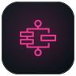</picture>
  <picture><source media="(prefers-color-scheme: dark)" srcset="assets/icons/dark/eventbridge.svg"><source media="(prefers-color-scheme: light)" srcset="assets/icons/light/eventbridge.svg">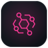</picture>
  <picture><source media="(prefers-color-scheme: dark)" srcset="assets/icons/dark/sns.svg"><source media="(prefers-color-scheme: light)" srcset="assets/icons/light/sns.svg">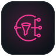</picture>
  <picture><source media="(prefers-color-scheme: dark)" srcset="assets/icons/dark/apigateway.svg"><source media="(prefers-color-scheme: light)" srcset="assets/icons/light/apigateway.svg">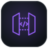</picture>
  <picture><source media="(prefers-color-scheme: dark)" srcset="assets/icons/dark/cloudfront.svg"><source media="(prefers-color-scheme: light)" srcset="assets/icons/light/cloudfront.svg">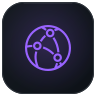</picture>
  <picture><source media="(prefers-color-scheme: dark)" srcset="assets/icons/dark/route53.svg"><source media="(prefers-color-scheme: light)" srcset="assets/icons/light/route53.svg"></picture>
  <picture><source media="(prefers-color-scheme: dark)" srcset="assets/icons/dark/cognito.svg"><source media="(prefers-color-scheme: light)" srcset="assets/icons/light/cognito.svg"></picture>
  <picture><source media="(prefers-color-scheme: dark)" srcset="assets/icons/dark/iam.svg"><source media="(prefers-color-scheme: light)" srcset="assets/icons/light/iam.svg"></picture>
  <picture><source media="(prefers-color-scheme: dark)" srcset="assets/icons/dark/secretsmanager.svg"><source media="(prefers-color-scheme: light)" srcset="assets/icons/light/secretsmanager.svg"></picture>
  <picture><source media="(prefers-color-scheme: dark)" srcset="assets/icons/dark/cloudwatch.svg"><source media="(prefers-color-scheme: light)" srcset="assets/icons/light/cloudwatch.svg"></picture>
  <picture><source media="(prefers-color-scheme: dark)" srcset="assets/icons/dark/cloudformation.svg"><source media="(prefers-color-scheme: light)" srcset="assets/icons/light/cloudformation.svg"></picture>
  <picture><source media="(prefers-color-scheme: dark)" srcset="assets/icons/dark/dynamodb.svg"><source media="(prefers-color-scheme: light)" srcset="assets/icons/light/dynamodb.svg">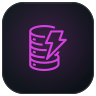</picture>
  <picture><source media="(prefers-color-scheme: dark)" srcset="assets/icons/dark/bedrock.svg"><source media="(prefers-color-scheme: light)" srcset="assets/icons/light/bedrock.svg">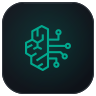</picture>
  <picture><source media="(prefers-color-scheme: dark)" srcset="assets/icons/dark/transcribe.svg"><source media="(prefers-color-scheme: light)" srcset="assets/icons/light/transcribe.svg"></picture>
  <picture><source media="(prefers-color-scheme: dark)" srcset="assets/icons/dark/textract.svg"><source media="(prefers-color-scheme: light)" srcset="assets/icons/light/textract.svg"></picture>
  <picture><source media="(prefers-color-scheme: dark)" srcset="assets/icons/dark/transferfamily.svg"><source media="(prefers-color-scheme: light)" srcset="assets/icons/light/transferfamily.svg"></picture>
  <picture><source media="(prefers-color-scheme: dark)" srcset="assets/icons/dark/ses.svg"><source media="(prefers-color-scheme: light)" srcset="assets/icons/light/ses.svg"></picture>

  <picture><source media="(prefers-color-scheme: dark)" srcset="assets/ui/dark/cat-gcp.svg"><source media="(prefers-color-scheme: light)" srcset="assets/ui/light/cat-gcp.svg"></picture>

  <picture><source media="(prefers-color-scheme: dark)" srcset="assets/icons/dark/gcp.svg"><source media="(prefers-color-scheme: light)" srcset="assets/icons/light/gcp.svg"></picture>
  <picture><source media="(prefers-color-scheme: dark)" srcset="assets/icons/dark/bigquery.svg"><source media="(prefers-color-scheme: light)" srcset="assets/icons/light/bigquery.svg"></picture>

  <picture><source media="(prefers-color-scheme: dark)" srcset="assets/ui/dark/cat-ai.svg"><source media="(prefers-color-scheme: light)" srcset="assets/ui/light/cat-ai.svg"></picture>

  <picture><source media="(prefers-color-scheme: dark)" srcset="assets/icons/dark/claude.svg"><source media="(prefers-color-scheme: light)" srcset="assets/icons/light/claude.svg"></picture>
  <picture><source media="(prefers-color-scheme: dark)" srcset="assets/icons/dark/tensorflow.svg"><source media="(prefers-color-scheme: light)" srcset="assets/icons/light/tensorflow.svg">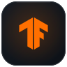</picture>
  <picture><source media="(prefers-color-scheme: dark)" srcset="assets/icons/dark/pytorch.svg"><source media="(prefers-color-scheme: light)" srcset="assets/icons/light/pytorch.svg"></picture>
  <picture><source media="(prefers-color-scheme: dark)" srcset="assets/icons/dark/keras.svg"><source media="(prefers-color-scheme: light)" srcset="assets/icons/light/keras.svg">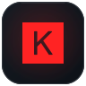</picture>
  <picture><source media="(prefers-color-scheme: dark)" srcset="assets/icons/dark/sklearn.svg"><source media="(prefers-color-scheme: light)" srcset="assets/icons/light/sklearn.svg"></picture>
  <picture><source media="(prefers-color-scheme: dark)" srcset="assets/icons/dark/opencv.svg"><source media="(prefers-color-scheme: light)" srcset="assets/icons/light/opencv.svg"></picture>
  <picture><source media="(prefers-color-scheme: dark)" srcset="assets/icons/dark/spacy.svg"><source media="(prefers-color-scheme: light)" srcset="assets/icons/light/spacy.svg">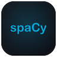</picture>
  <picture><source media="(prefers-color-scheme: dark)" srcset="assets/icons/dark/ollama.svg"><source media="(prefers-color-scheme: light)" srcset="assets/icons/light/ollama.svg"></picture>

  <picture><source media="(prefers-color-scheme: dark)" srcset="assets/ui/dark/cat-databases.svg"><source media="(prefers-color-scheme: light)" srcset="assets/ui/light/cat-databases.svg"></picture>

  <picture><source media="(prefers-color-scheme: dark)" srcset="assets/icons/dark/oracle.svg"><source media="(prefers-color-scheme: light)" srcset="assets/icons/light/oracle.svg">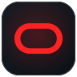</picture>
  <picture><source media="(prefers-color-scheme: dark)" srcset="assets/icons/dark/postgresql.svg"><source media="(prefers-color-scheme: light)" srcset="assets/icons/light/postgresql.svg"></picture>
  <picture><source media="(prefers-color-scheme: dark)" srcset="assets/icons/dark/mysql.svg"><source media="(prefers-color-scheme: light)" srcset="assets/icons/light/mysql.svg"></picture>
  <picture><source media="(prefers-color-scheme: dark)" srcset="assets/icons/dark/sqlserver.svg"><source media="(prefers-color-scheme: light)" srcset="assets/icons/light/sqlserver.svg">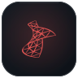</picture>
  <picture><source media="(prefers-color-scheme: dark)" srcset="assets/icons/dark/redis.svg"><source media="(prefers-color-scheme: light)" srcset="assets/icons/light/redis.svg"></picture>
  <picture><source media="(prefers-color-scheme: dark)" srcset="assets/icons/dark/elasticsearch.svg"><source media="(prefers-color-scheme: light)" srcset="assets/icons/light/elasticsearch.svg"></picture>
  <picture><source media="(prefers-color-scheme: dark)" srcset="assets/icons/dark/solr.svg"><source media="(prefers-color-scheme: light)" srcset="assets/icons/light/solr.svg"></picture>
  <picture><source media="(prefers-color-scheme: dark)" srcset="assets/icons/dark/salesforce.svg"><source media="(prefers-color-scheme: light)" srcset="assets/icons/light/salesforce.svg"></picture>

  <picture><source media="(prefers-color-scheme: dark)" srcset="assets/ui/dark/cat-devops.svg"><source media="(prefers-color-scheme: light)" srcset="assets/ui/light/cat-devops.svg"></picture>

  <picture><source media="(prefers-color-scheme: dark)" srcset="assets/icons/dark/docker.svg"><source media="(prefers-color-scheme: light)" srcset="assets/icons/light/docker.svg">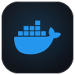</picture>
  <picture><source media="(prefers-color-scheme: dark)" srcset="assets/icons/dark/kubernetes.svg"><source media="(prefers-color-scheme: light)" srcset="assets/icons/light/kubernetes.svg">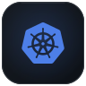</picture>
  <picture><source media="(prefers-color-scheme: dark)" srcset="assets/icons/dark/terraform.svg"><source media="(prefers-color-scheme: light)" srcset="assets/icons/light/terraform.svg">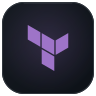</picture>
  <picture><source media="(prefers-color-scheme: dark)" srcset="assets/icons/dark/githubactions.svg"><source media="(prefers-color-scheme: light)" srcset="assets/icons/light/githubactions.svg"></picture>
  <picture><source media="(prefers-color-scheme: dark)" srcset="assets/icons/dark/git.svg"><source media="(prefers-color-scheme: light)" srcset="assets/icons/light/git.svg">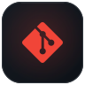</picture>
  <picture><source media="(prefers-color-scheme: dark)" srcset="assets/icons/dark/jenkins.svg"><source media="(prefers-color-scheme: light)" srcset="assets/icons/light/jenkins.svg"></picture>
  <picture><source media="(prefers-color-scheme: dark)" srcset="assets/icons/dark/linux.svg"><source media="(prefers-color-scheme: light)" srcset="assets/icons/light/linux.svg">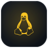</picture>
  <picture><source media="(prefers-color-scheme: dark)" srcset="assets/icons/dark/vmware.svg"><source media="(prefers-color-scheme: light)" srcset="assets/icons/light/vmware.svg"></picture>
  <picture><source media="(prefers-color-scheme: dark)" srcset="assets/icons/dark/grafana.svg"><source media="(prefers-color-scheme: light)" srcset="assets/icons/light/grafana.svg"></picture>
  <picture><source media="(prefers-color-scheme: dark)" srcset="assets/icons/dark/kibana.svg"><source media="(prefers-color-scheme: light)" srcset="assets/icons/light/kibana.svg">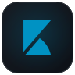</picture>

  <picture><source media="(prefers-color-scheme: dark)" srcset="assets/ui/dark/cat-tools.svg"><source media="(prefers-color-scheme: light)" srcset="assets/ui/light/cat-tools.svg"></picture>

  <picture><source media="(prefers-color-scheme: dark)" srcset="assets/icons/dark/flask.svg"><source media="(prefers-color-scheme: light)" srcset="assets/icons/light/flask.svg"></picture>
  <picture><source media="(prefers-color-scheme: dark)" srcset="assets/icons/dark/fastapi.svg"><source media="(prefers-color-scheme: light)" srcset="assets/icons/light/fastapi.svg">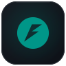</picture>
  <picture><source media="(prefers-color-scheme: dark)" srcset="assets/icons/dark/selenium.svg"><source media="(prefers-color-scheme: light)" srcset="assets/icons/light/selenium.svg">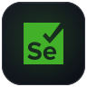</picture>
  <picture><source media="(prefers-color-scheme: dark)" srcset="assets/icons/dark/playwright.svg"><source media="(prefers-color-scheme: light)" srcset="assets/icons/light/playwright.svg"></picture>
  <picture><source media="(prefers-color-scheme: dark)" srcset="assets/icons/dark/scrapy.svg"><source media="(prefers-color-scheme: light)" srcset="assets/icons/light/scrapy.svg"></picture>
  <picture><source media="(prefers-color-scheme: dark)" srcset="assets/icons/dark/ffmpeg.svg"><source media="(prefers-color-scheme: light)" srcset="assets/icons/light/ffmpeg.svg">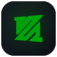</picture>
  <picture><source media="(prefers-color-scheme: dark)" srcset="assets/icons/dark/powerbi.svg"><source media="(prefers-color-scheme: light)" srcset="assets/icons/light/powerbi.svg"></picture>
  <picture><source media="(prefers-color-scheme: dark)" srcset="assets/icons/dark/vscode.svg"><source media="(prefers-color-scheme: light)" srcset="assets/icons/light/vscode.svg"></picture>
  <picture><source media="(prefers-color-scheme: dark)" srcset="assets/icons/dark/jira.svg"><source media="(prefers-color-scheme: light)" srcset="assets/icons/light/jira.svg"></picture>
  <picture><source media="(prefers-color-scheme: dark)" srcset="assets/icons/dark/confluence.svg"><source media="(prefers-color-scheme: light)" srcset="assets/icons/light/confluence.svg"></picture>

  <picture><source media="(prefers-color-scheme: dark)" srcset="assets/ui/dark/section-connect.svg"><source media="(prefers-color-scheme: light)" srcset="assets/ui/light/section-connect.svg"></picture>

Open to data and cloud engineering challenges. The fastest way to reach me is by [email](mailto:m.elkhou@hotmail.com) or on [LinkedIn](https://www.linkedin.com/in/m-elkhou/).

  <a href="https://m-elkhou.github.io/"><picture><source media="(prefers-color-scheme: dark)" srcset="assets/ui/dark/button-portfolio.svg"><source media="(prefers-color-scheme: light)" srcset="assets/ui/light/button-portfolio.svg"></picture></a>
  <a href="https://www.linkedin.com/in/m-elkhou/"><picture><source media="(prefers-color-scheme: dark)" srcset="assets/ui/dark/button-linkedin.svg"><source media="(prefers-color-scheme: light)" srcset="assets/ui/light/button-linkedin.svg"></picture></a>
  <a href="mailto:m.elkhou@hotmail.com"><picture><source media="(prefers-color-scheme: dark)" srcset="assets/ui/dark/button-email.svg"><source media="(prefers-color-scheme: light)" srcset="assets/ui/light/button-email.svg"></picture></a>
  <a href="https://m-elkhou.github.io/assets/cv/Mohammed_EL-KHOU_CV.pdf"><picture><source media="(prefers-color-scheme: dark)" srcset="assets/ui/dark/button-cv.svg"><source media="(prefers-color-scheme: light)" srcset="assets/ui/light/button-cv.svg"></picture></a>

Visuals generated by <a href="tools/">tools/</a> · logos from Simple Icons (CC0) and the AWS Architecture Icons · all trademarks belong to their owners.

